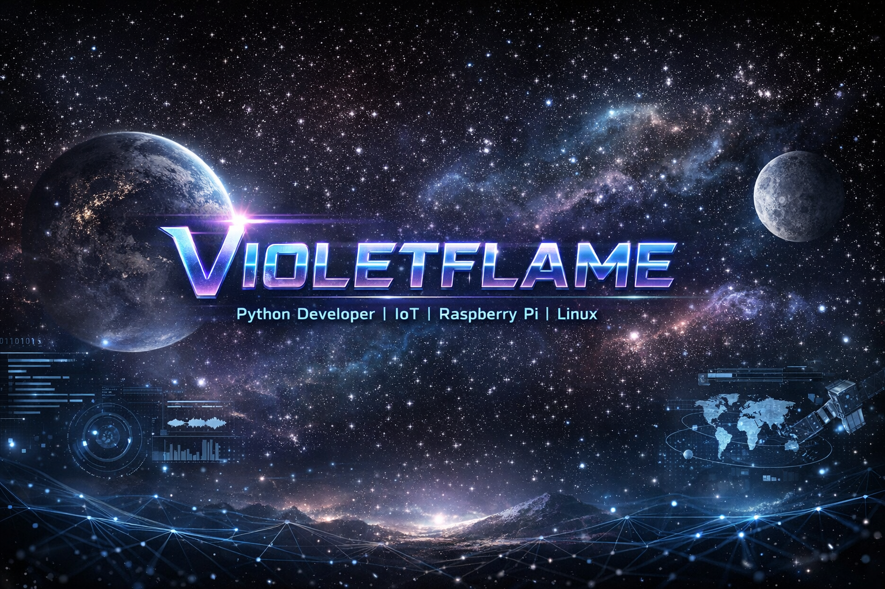

  

  

---

## 👋 About Me

I'm a passionate **Python & HTML developer** with a strong interest in **IoT**, **Arduino**, and **Raspberry Pi**.  
I love building real-world systems that combine **hardware + software**, working with **Linux**, and exploring how things work under the hood.

---

## 🚀 What I Do

- 🤖 Build IoT projects using Raspberry Pi & Arduino  
- 💻 Develop websites & automation scripts  
- 🐧 Work with Linux systems (CentOS 8 & 9)  
- 🌐 Manage remote devices using SSH  
- 📷 Camera streaming & system setups  

---

## 🛠️ Tech Stack

### 👨‍💻 Languages  

### 🤖 IoT & Hardware  

### 🐧 Systems & Tools  

## 🏆 Featured Projects

### 🌐 Chronova Website  
🔗 https://github.com/Violetflame124610/Projects/tree/main/HTML/Chronova  

### 📷 Raspberry Pi 5 USB Camera Live Stream  
🔗 https://github.com/Violetflame124610/Projects/tree/main/IOT/RPI5/Setting%20up%20camera  

### 📂 All My Projects  
🔗 https://github.com/Violetflame124610/Projects/tree/main  

## 🧪 Current Projects

- Improving my Chronova website  
- Experimenting with Raspberry Pi camera systems  
- Learning Linux server management  
- Writing Python automation scripts  

---

## 🧠 Learning Roadmap

- Advanced Python  
- Linux system administration  
- Networking basics  
- IoT integrations  
- Backend fundamentals  

---

## 🎮 Interests

- Hardware tinkering  
- Automation  
- Open-source  
- Tech experiments  
- System optimization  

---

## 🚀 Future Plans

- Build smart home projects  
- Create useful automation tools  
- Develop full web apps  
- Contribute to open source  
- Become a full-stack + IoT engineer

---

## 📫 Connect With Me

🐙 GitHub: https://github.com/Violetflame124610  

---

⭐ If you like my work, consider following me!
